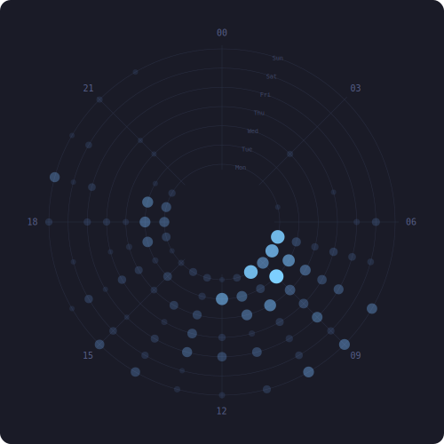

# Hey, I'm Wes

**Infrastructure engineer · Systems architect · Compulsive builder of things**

18+ years building systems that run, scale, and occasionally explode in interesting ways. 
Currently at **[Clocktower and Associates](https://www.clocktowerassoc.com)** — AI tooling, blockchain infrastructure, and web audits.

I name my projects after literary characters and give them attitudes. It's a whole thing.

---

## 📝 Latest from the Blog

I write about AI agents, infrastructure, security, and open-source tools at [dev.to/ticktockbent](https://dev.to/ticktockbent).

<!-- BLOG-POSTS:START -->
<!-- This section is auto-updated nightly by a GitHub Action -->
| Post | Description |
|---|---|
| [htop for Your Git History](https://www.wshoffner.dev/blog/gittop) | You clone a repo you've never seen before and you want to understand it. Not the code, not yet. The... |
| [What's Actually in Your Docker Image? Reading the Parser That Tells You](https://www.wshoffner.dev/blog/xray) | Everyone who works with Docker images eventually asks the question: why is this image 2 GB? You... |
| [When AI Writes Your Firewall, Check the Math](https://www.wshoffner.dev/blog/blackwall) | A Python developer with "AI Solutions Architect" in their GitHub bio pushes 8,500 lines of eBPF Rust... |
| [A Rust TUI for Your UniFi Network That Actually Takes Code Review Seriously](https://www.wshoffner.dev/blog/unifly) | If you run UniFi gear, you manage it through a web UI. That's fine until you need to script... |
| [Anatomy of a GitHub Actions Supply Chain Attack Targeting MCP Repos](https://www.wshoffner.dev/blog/anatomy-of-a-github-actions-supply-chain-attack-targeting-mcp-repos) | On April 7th, someone submitted a pull request to my project Charlotte. 28 lines. One new file. A... |
<!-- BLOG-POSTS:END -->

---

## 🔨 What I Build

**AI Agent Infrastructure** — MCP servers, semantic memory, distributed coordination, and web standards for the agent era.

**Blockchain & DeFi** — Prediction markets, escrow protocols, staking systems, and on-chain analytics on Ethereum and Polygon.

**Games** — Browser puzzles, Unity prototypes, idle games, and simulations. If it has a game loop, I've probably built one at 2am.

**Infrastructure** — Docker, Kubernetes, Flux, CI/CD, and Conway's Game of Life distributed across a k8s cluster because why not.

---

## 🧰 Tech Stack

**Languages** 

**Infrastructure** 

**Blockchain** 

---

## 📊 Stats

---

## ⏱ Commit Clock

*Inner ring = Monday, outer = Sunday. Midnight at top. Updated weekly.*

---

## 📖 Interactive Fiction

A collaborative story, one turn at a time. Anyone can continue — just comment on the story issue.

**The rules:** No back-to-back turns. 500 character limit. That's it.

[📜 Join the story →](https://github.com/TickTockBent/ticktockbent/issues?q=is%3Aissue+is%3Aopen+label%3Ainteractive-fiction)

---

## 🕹️ Flynn's Arcade

*A random game plays every time you visit. [How it works →](https://github.com/TickTockBent/flynn)*

---

## 🎲 When I'm Not Coding

- 🖨️ 3D printing things that probably didn't need to be 3D printed
- 🎮 Designing games I'll finish one day (the prototypes have prototypes)
- 📚 Discworld completionist — GNU Terry Pratchett
- 🧪 Convincing distributed systems to agree on things (they never do)

---

Open to collaboration, contributions, and projects with unreasonable scope.

